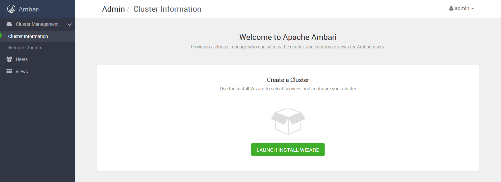
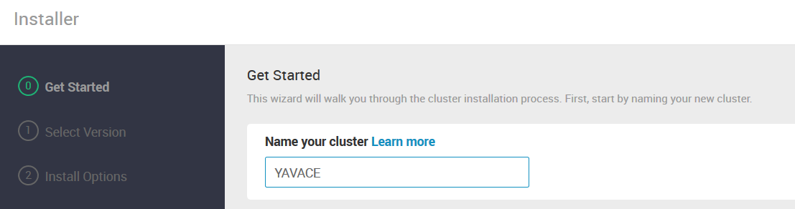
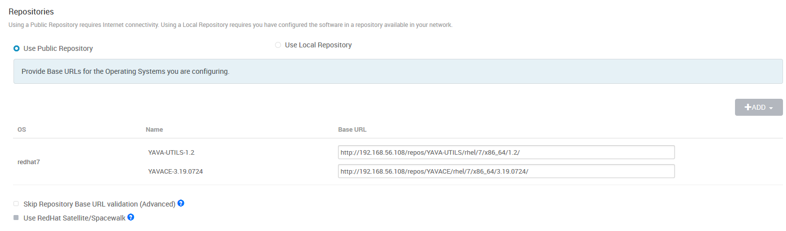
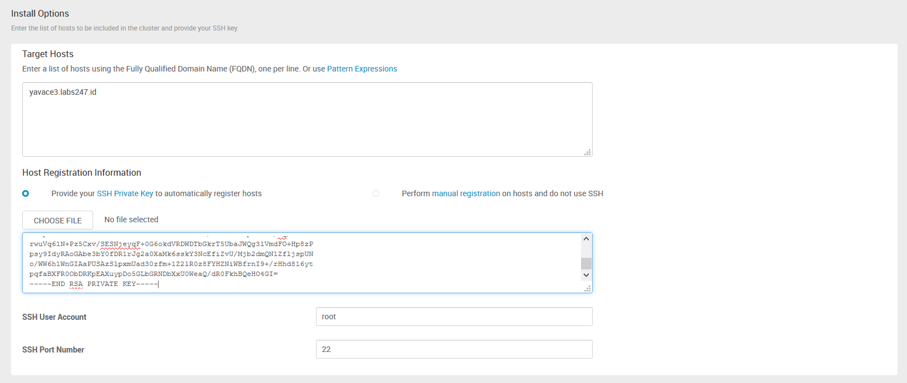
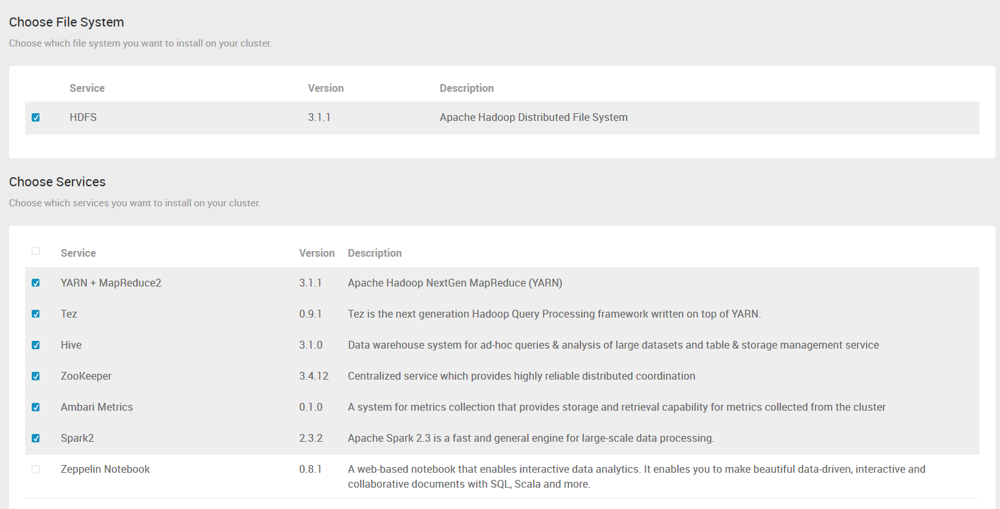
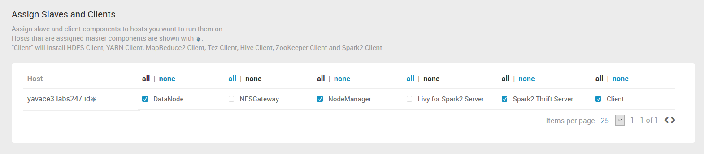
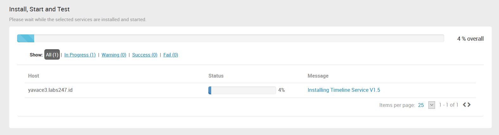
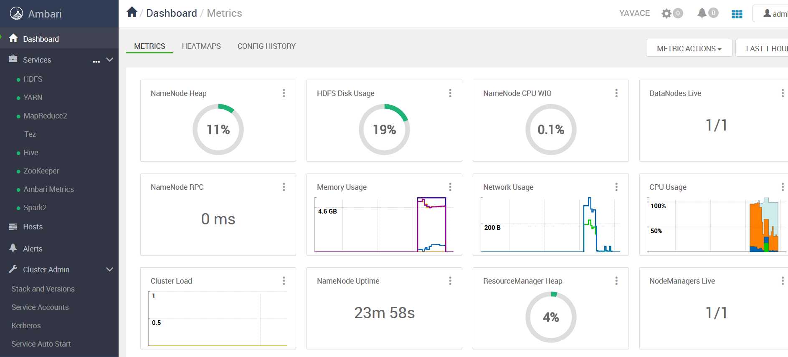

Instalasi Single Node YavaCE
=====================================================

Setelah Ambari Server berjalan dengan baik, tahap berikutnya adalah membuat cluster dan menginstall YavaCE. Kita akan membuat cluster pada server yang sama dengan Ambari Server dan hanya satu node. Nama cluster yang akan kita buat dapat disesuaikan dengan keperluan. Pada resep ini akan kita diberi nama YAVACE. Proses instalasi cukup mudah karena akan menggunakan panduan dari Ambari Server.

## Langka-langkah

1. Log in ke dalam Ambari Server sebagai admin dengan menggunakan web browser

2. Kita akan membuat cluster secara mudah dengan klik tombol "Launch Install Wizard"


<br>
<br>

3. Masukkan nama cluster


<br>
<br>

4. Pastikan alamat repository yang akan digunakan sudah sesuai


<br>
<br>

5. Masukkan list nama server dan masukkan ssh private key dari Ambari Server


<br>
<br>

Untuk memperoleh SSH Private Key dari server yang digunakan oleh Ambari, akses server menggunakan console atau ssh client seperti putty dengan menggunakan user root. Lakukan peritah berikut:
```bash
cat .ssh/id_rsa
```
Copy hasilnya, dan disalin ke isian SSH Private Key

6. Ikuti saja proses berikutnya dan tunggu sejenak hingga proses registrasi dan verifikasi selesai
7. Setelah selesai dan tidak ada kesalahan, pilih service yang akan diinstal. Semua service diberi tanda kecuali Zeppelin Notebook, karena nantinya kita akan menggunakan Apache Zeppelin versi aslinya, atau bisa juga menggunakan notebook lain.


<br>
<br>

8. Ikuti langkah berikutnya tanpa ada perubahan
9. Pada bagian Assign Slave and Client, pastikan Spark2 Thrift Server ikut terinstal


<br>
<br>

10. Ikuti langkah selanjutnya, jika diminta mengisi password, isilah sesuai dengan kebutuhan
11. Tunnggu hingga proses Install, Start and Test selesai, karena memakan waktu cukup lama


<br>
<br>

12. Jika semua telah selesai tanpa masalah, maka semua service yang diinstall akan otomatis hidup


<br>
<br>

13. YavaCE siap untuk digunakan
